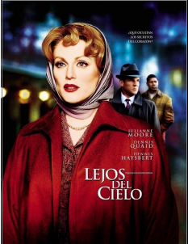

****

**C****I****N****E****F****O****R****U****M**

**24 de Febrero.17:00 horas**

**En una sociedad de los años 50**

**presentar****el racismo y las homosexualidad**

**con personas reales**

**(no estereotipos)**

“**no estoy segura de que sea**

**una buena idea****”**

**pero para los críticos…**

**es la mejor película de 2002**

**NO TE LA PIERDAS**

**Parroquia Ntra. Sra. de la Vid**

**Solo acatando****la ley**

**que dictan****la tolerancia**

**y los sentimientos más****sinceros**

**Y**

**viviendo****la realidad****día a día**

**podremos ser****útiles**

**dibujando el mapa de****una existencia**

**si no****feliz**

**al menos****digna y valiosa**

**Parroquia Nuestra Sra. de la Vid**

* * *

[Cinefurm - Lejos del cielo](cinefurm-lejos-del-cielo.pdf)
