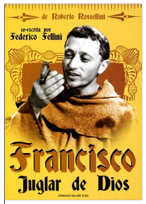
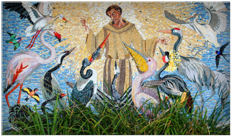
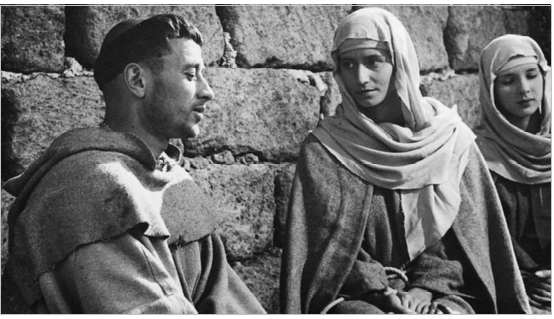
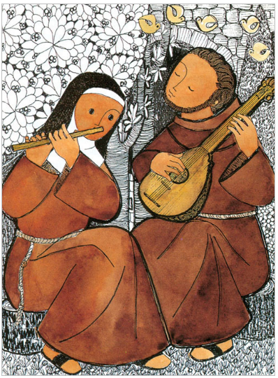

**C****I****N****E****F****O****R****U****M**

**16 de diciembre.17:00 horas**

  

**O.-**_**Datos técnicos**_

**Título original: Francesco, giullare di Dio**

**Pais: Italia**

**Duración: 75 minutos**

**Año: 1950**

**Clasificación por edades: Recomendada para todos los públicos**

**Director: Roberto Rosellini**

**Reparto: Nazario Gerardi, Aldo Fabrizi, Aribella Lomaitre, Roberto Sorrentino**

**1.-**_**Sinopsis**_

**Doce viñetas centradas en la vida de San Francisco y sus primeros seguidores, empezando con su regreso a Rivotorlo desde Roma después de que el Papa bendijera por primera vez la orden franciscana y pusiera fin a su dispersión.**

**Los capítulos inconexos son como parábolas, algunas de ellas con moraleja, siempre reflejando cómo la hermandad está impregnada de fantasía y buenos sentimientos, construyendo un camino entre la vida armoniosa y la religiosidad.**

**El divertido Ginepro vuelve desnudo a Santa María de los Ángeles después de haber entregado su túnica, pero no el requesón que llevaba. El anciano Giovanni grita y sujeta su túnica mientras el beato San Clair le hace una visita. El humilde Francisco duda de su liderazgo, abraza a un leproso y consigue que sus hermanos vayan sonrientes y alegres por el mundo…**

**2.-**_**El Director**_

******El director, Roberto Rosellini, es uno de los máximos exponentes del neorrealismo italiano. Este movimiento se caracterizó por rodaje en exteriores (nunca en platós) y actores no profesionales que tenían total libertad de improvisación.**

**Tras su gran éxito, Roma, ciudad abierta (1945) a lo largo de su carrera dirigió muchas otras películas de temática religiosa como Juana de Arco (1954), De Jerusalen a Damasco (1970), Agustín de Hipona (1972) o El Mesías (1975).**

**Se trata de un film bastante corto (83 minutos) interpretado en su mayoría por religiosos franciscanos de un monasterio italiano (San Francisco, por ejemplo, es fray Nazario Gerardi). Uno de los pocos actores profesionales es Aldo Fabrizi, quien interpreta a Nicolaio, el tirano de Viterbo.**

**3.-**_**Película no apta para…**_

**Como espectador solo se puede recomendar que se olvide de sus fobias religiosas, sí es que las tiene, y que ahonde en la filmografía del director antes de enfrentarse a esta singular cinta. Solo así tendrá la posibilidad de profundizar, de la mano de Roberto, en un concepto tan sencillo, y complejo a la vez, como la pobreza y su predicación como forma de vida…**

**4.-**_**Aspectos importantes de la película**_

**4.1.-**_**Presentación de “la religión”**_

******Lo religioso se ha mostrado en el cine de muchas maneras, pero en pocas de una forma tan natural y plena como en esta película, en la que al modo de los devocionarios o de los libros de santos (de antaño) se ilustra con “estampitas” varios episodios de la vida de san Francisco de Asís. En ellos la vivencia religiosa está dominada por los valores de la humildad, el servicio, la dulzura y la alegría.**

**Una pregunta en el aire: ¿Es posible la vivencia de la religión de esta manera…hoy día?**

**4.2.-**_**La importancia del “ejemplo”**_

******¿Cómo entienden a Dios Francesco y sus hermanos? Sólo lo podremos saber por su comportamiento, no por sus declaraciones, porque para ellos el ejemplo es la única doctrina y su experiencia de lo divino es ante todo vital, no intelectual.**

******Son hombres que se sienten llenos de Dios y viven ajenos a toda angustia o duda existencial: para ellos lo sagrado es algo cotidiano y palpable y eso les permite una entrega ilimitada. En su comportamiento hay algo (mucho) de atolondramiento e idealismo adolescentes: se sienten impelidos a dar testimonio y a actuar, y su forma de hacerlo es ser extremadamente generosos con los demás.**

**4.3.-**_**Una presentación de Dios**_

**En otras películas Dios es presentado a menudo como una ausencia y una tortura personal, alguien a quien se reclaman responsabilidades por el dolor y los males del mundo… aquí , en cambio, es un gozo y una presencia continua, una forma de plenitud. No hay oraciones en silencio, sino cantos en comunidad: la capilla de Santa María de los Ángeles es un lugar tumultuoso con aires de fiesta infantil. Lo espiritual no es sinónimo de estatismo sino de todo lo contrario: Dios está en el mundo, en el trabajo, en el juego, en el amor por los demás.**

**4.4.-**_**Un mensaje para un pueblo concreto**_

**La película demuestra una verdad que cuesta descubrir, que es la mentalidad del pueblo y sus problemas en aquellos tiempo, un duro ejercicio para el que escogía la labor de predicador y trabajador humilde, que trata de dar una respuesta evangélica a unas situaciones concretas diferentes a las de hoy día…**

**4.5.-**_**Un retrato de la pobreza**_

**El crear un retrato de la pobreza como forma de vida completa y como único camino para acercarse a Dios supone un desafío donde, por encima de todo, debes mostrar, enseñar y sugerir, huyendo siempre de inducir, de manipular o de dirigir. Y Roberto lo consigue, a su manera, pero lo consigue.**

**No hay un guion complejo y cuidado, como siempre, tampoco hay actuaciones profesionales (la mayoría son frailes de un convento cercano incluyendo al que interpreta a Francisco) o una puesta en escena planificada y estudiada. Pero si hay humanidad, misericordia, caridad, generosidad, compasión, clemencia, piedad, bondad, indulgencia, fe y amor, mucho amor. Pero amor por la persona como tal, no por las cosas que pueda tener o poseer…**

**4.6.-**_**Un canto a la inocencia**_

**En la película transita una desarmadora alegría vital, y conceptos tales como inocencia o ingenuidad —que en este mundo nuestro parece que solo sirvan ya para ridiculizar a la persona que los recibe— recuperan su auténtica dignidad.**

**No quisiera pasar por alto el episodio del encuentro nocturno de Francisco con el leproso, uno de los momentos más intensamente conmovedores de toda la obra rosselliniana.**

**El movimiento franciscano es, en origen, una vuelta a esa inocencia primera, al idealismo de seguir unos principios siendo fieles a ellos y sin cuestionarse nada más. En cierta forma se defiende una ingenuidad que recuerda el "hacerse niños" que Jesucristo reclamaba para sus seguidores como norma de vida en el Evangelio de San Mateo 18,3.**

****

**  
  
**
