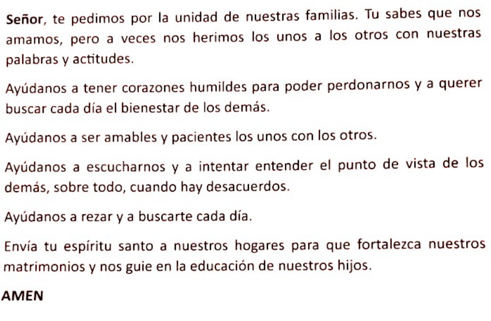

##  REUNION DEL 16 DE OCTUBRE DEL GRUPO DE FAMILIAS JOVENES 

Ayer tuvimos la tercera reunión de nuestro grupo, la participación podría haber sido mejor, pero en cambio resultó muy productiva. Vimos el video del enlace que os adjuntamos. Los comentarios fueron situaciones personales vividas por los unos y los otros, no teorías o sermones y ahora, antes de ponerme a escribir el resumen, he releído el capitulo 4 de la A.L.y he visto que lo que hablamos ayer esta reflejado, casi al pié de la letra en ella. 

El amor necesita paciencia, y por paciencia no entendemos tragar lo que sea. Pero existe un riesgo en el matrimonio de esperar relaciones perfectas y nadie es perfecto, por eso caemos una y otra vez en los mismos fallos y el único camino es el perdón. La persona amada tiene derecho a vivir siendo como es y asi la quiere Jesús. ¿Como no la voy a querer yo? La paciencia no es una postura pasiva, sino que tiene que estar acompañada por una actividad. En el amor son mas importantes las obras que las palabras.

El amor valora los logros ajenos, no los siente como una amenaza. El centro del amor simpre esta en el otro, en hacer mas feliz al otro. La amabilidad y la delicadeza no deben darse por descontadas, no son perdida de tiempo. Hay que ponerlo en valor todos los días.

Irritarse, perder los nervios es dañino nos desestabiliza y perdemos la paz interior. Sobre este tema es conveniente el compromiso de no dejar que la puesta de sol nos pille sin restituir la irritación. Es útil marcarse la obligación de compartir una pequeña oración antes de ir a la cama, sobre todo, si estamos enfadados.

Cuando discutimos con nuestra pareja, lo hacemos por UNA COSA y porque queremos ponernos de acuerdo. No ayuda para nada poner encima de la mesa el DOSIER de las afrentas de los últimos SIGLOS… Mi pareja puede tener cosas malas, pero tambien tiene una gran lista de cosas buenas que hay que valorar, sobre todo en las discusiones. En cualquier caso si debe estar en la mesa el bote del perdón y, si a pesar de todo, la atmosfera se calienta parar, tomar una tila y esperar a que haga efecto.

Evidentemente no es una tarea fácil, y menos cuando nuestro entorno no participa de estas ideas. Por eso es muy importante tener un grupo de referencia con el q.ue poder compartir y comentar como lo vamos consiguiendo y las dificultades que encontramos y esta claro que esto exige sacrificios y renuncias, en el fondo tiempo, pero vale la pena

Enlace al video: [https://www.youtube.com/watch?v=ZfWz0X_GfIk&t=14s](https://www.youtube.com/watch?v=ZfWz0X_GfIk&t=14s)

