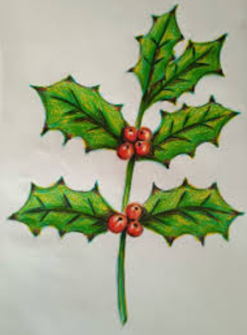

##  [ Felicitaciones de Navidad](/actividades/tiempos-liturgicos/navidad/227-felicitaciones-de-navidad)

**FELICITACIONES DE NAVIDAD**

De nuevo este año vamos a felicitarnos entre todos, sin edad. 

  
¿Cómo? Hacemos una felicitación de Navidad en papel (A5 o A4), sin doblar y con el nombre por detrás.

Puede ser una frase, haiku u otro verso, dibujo, foto, o video tipo Tic-Toc…En este caso colocaremos en el panel una foto del video y un codigo QR que apunte a su dirección para verlo en el movil. Expondremos todas las felicitaciones en el atrio de la Iglesia.

  
Para los peques habrá dos o tres premios por votación popular. (Pondremos una "Estrella" por delante del trabajo para identificar la categoria de hasta los 13 años).

  
Podéis entregarlo en el despacho, a cualquiera de los sacerdotes, a vuestro catequista, o por correo electrónico a este buzón:

Esta dirección de correo electrónico está siendo protegida contra los robots de spam. Necesita tener JavaScript habilitado para poder verlo.

  
¡¡VAMOS A FELICITARNOS CON LA ALEGRÍA DE LA NAVIDAD!!  
También se pueden hacer de forma familiar, o en grupos...
