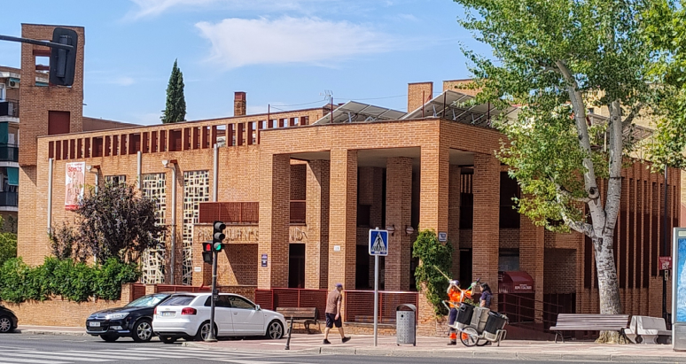

##  LA PARROQUIA 

  
  
La funciones de la parroquia, son: 

1\. Celebración de Sacramentos: La parroquia es el lugar donde se celebran los sacramentos, como el bautismo, la primera comunión, la confirmación, el matrimonio y la unción de los enfermos.  
  
2\. Culto y Liturgia: Organiza y lleva a cabo las celebraciones litúrgicas, como la misa dominical y otras celebraciones religiosas.  
  
3\. Educación Religiosa: Ofrece catequesis y formación religiosa para niños, jóvenes y adultos, ayudando a la comunidad a profundizar en su fe.  
  
4\. Apoyo Espiritual: Proporciona orientación y apoyo espiritual a los feligreses, a través de la confesión, consejería y acompañamiento en momentos difíciles.  
  
5\. Actividades Comunitarias: Fomenta la vida comunitaria mediante actividades sociales, culturales y de voluntariado, promoviendo la solidaridad y el apoyo mutuo entre los miembros.  
  
6\. Asistencia Social: Muchas parroquias también se involucran en obras de caridad, ayudando a los más necesitados a través de comedores, roperos y programas de asistencia.  
  
7\. Promoción de Valores: Trabaja en la promoción de valores éticos y morales en la comunidad, contribuyendo a la formación de una sociedad más justa y solidaria.
