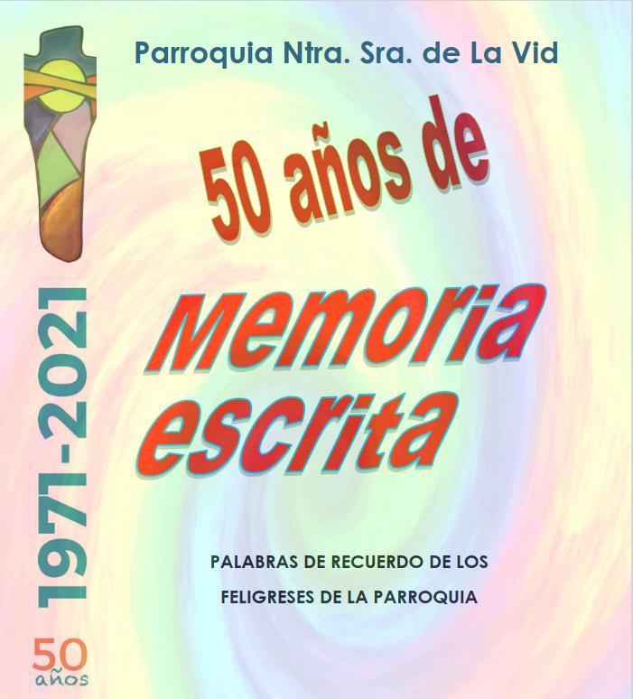

__

##  [ HISTORIAS DE 50 AÑOS](/actividades/historico/celebracion-de-los-50-anos-de-la-iglesia/62-historias-de-50-anos)

ÍNDICE  
•3 - Romance de La Vid - Telesforo Gil  
•5 - Sentimientos - Varios autores  
•6 - Mi juventud son recuerdos... - Beatriz Hurtado  
•7 - Coria en 1971 - Vicenta Carballo  
•7 - Las vueltas que da la vida - Montse Ruiz  
•8 - En una misa cercana a las Navidades - Laila Salgado  
•8 - Tempranales - Luis García  
•9 - Encuentros en Familia - Ma Cruz Borja  
•10- Cantando, cantando - Verónica David  
•11- Compañía de teatro “La Vid” - Consuelo Valdaliso  
•12- Las Recomendaciones - Jesús Soriguren  
•13- 50 años Parroquia N. S. de La Vid - Guillermo y Ana  
•15- Proyecto Tejo - Jesús Portilla  
•16- 50 años son muchos - Cristina Gandía  
•18- Anécdota con el Cardenal Rouco - Juan Bel  
•19- Nuestra Gran familia Tombolera - Iluminada Garrido  
•19- Los estereotipos - Jesús Soriguren  
•21- Pastoral Sanitaria - Ascensión Moreira  
•24- Mi parroquia y yo -José Ma Fernández  
•26- 50 años colaborando en limpieza - Mari Díaz  
•27- Nuestra iglesia de La Vid - Alicia San Andrés  
•28- La parroquia sustenta mi fe - Juan Murga  
•29- En La Vid desde 197... - Loli Ponce  
•32- La JMJ en Puertas Abiertas - Enrique G. y Amaya V.  
•33- Un Belén que nos une - Grupo Belenista  
•35- 1a Marcha Mariana Interprovincial - Enrique Gómez  
•37- Un Cine-Fórum muy participativo - J. Soriguren y J. Bel  
•40- La Parroquia N. S. de La Vid - Margarita Valiente  
•41- Lo más bello está por venir - José Luis del Castillo

_***Pulsando el enlace sigiente se puede descargar el libro._

[ Lee más: HISTORIAS DE... ](/actividades/historico/celebracion-de-los-50-anos-de-la-iglesia/62-historias-de-50-anos)
