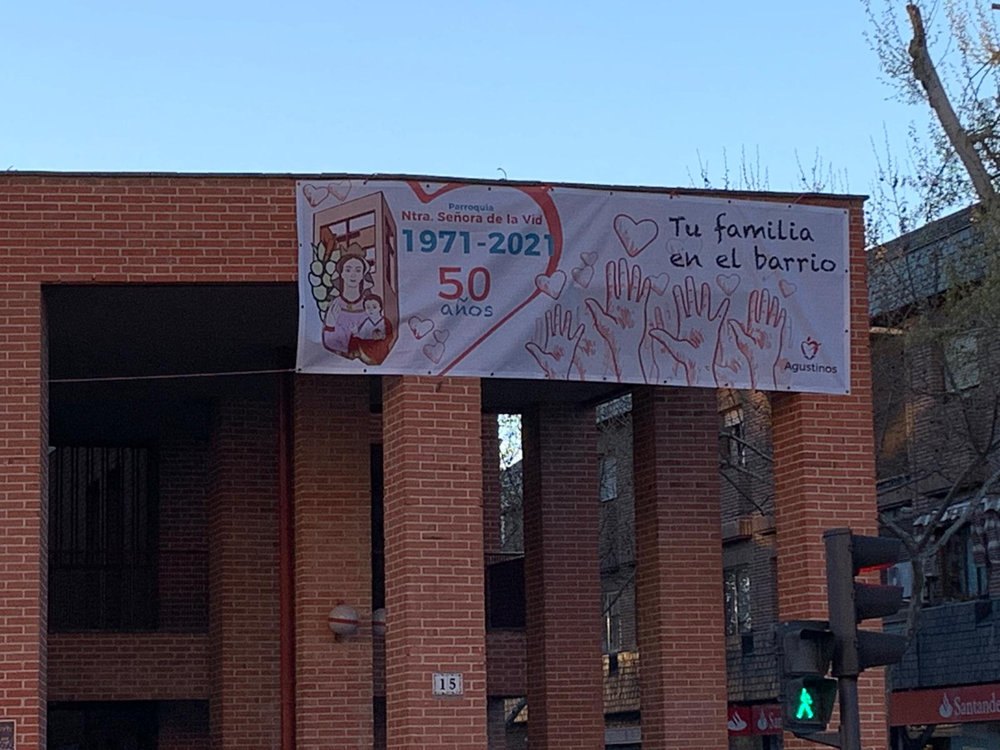

__

##  [ QUIENES SOMOS](/la-parroquia/quiens)

Nuestro nombre al margen de su cercanía a la zona donde está emplazada la llamada “Zaporra”, viñas, en su momento, común a los municipios de Alcobendas y San Sebastiánde Los Reyes, corresponde a la advocación mariana propia de la Ribera del Duero, Santa María de la Vid, gran monasterio premonstratense regido por los agustinos tras la desamortización del s. XIX, que todavía se puede ver y disfrutar en el pueblo al que ha dado origen, La Vid (Burgos).

Unos 16.000 vecinos de nuestro pueblo pertenecen por su demarcación geográfica a la parroquia.

NUESTRA HISTORIA

[ leer mas....QUIENES SOMOS ](/la-parroquia/quiens)
