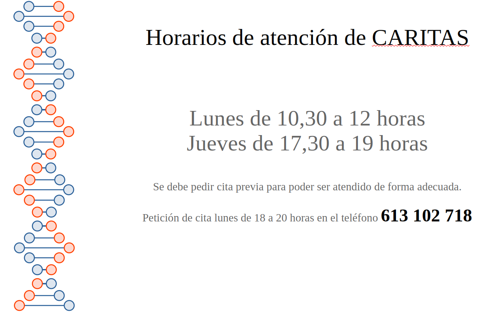

__

##  CARITAS 

Cáritas es una organización internacional de ayuda y desarrollo social que trabaja en todo el mundo para combatir la pobreza y la exclusión social. Fundada en 1897 en Alemania y con una red que abarca más de 160 países, Cáritas actúa principalmente a través de Caritas Internationalis, una confederación de organizaciones nacionales que operan bajo los principios de la Iglesia Católica

La misión de Cáritas es apoyar a las personas más vulnerables y desfavorecidas, ofreciendo ayuda humanitaria en situaciones de emergencia, promoviendo el desarrollo sostenible y trabajando por la justicia social. Sus programas incluyen asistencia alimentaria, atención médica, educación, rehabilitación de víctimas de desastres, y apoyo a la integración de inmigrantes y refugiados, entre otros.

La organización se basa en la solidaridad y el compromiso con los principios de la dignidad humana, la justicia y el amor cristiano, tratando de construir un mundo más justo y equitativo.

En la parroquia de Nuestra Señora de la Vid, Cáritas en una parte fundamental y la llena de sentido. De momento atiende a los que lo necesitan los lunes de 10,30 a 12 y los jueves de 17,30 a 19, previa petición de cita, y organiza una recogida de alimentos una vez al mes.

  * [ __](https://www.facebook.com/sharer.php?u=https://la-vid.org/la-parroquia/caritas/37-caritas)

  * 

  * [ __](https://www.linkedin.com/shareArticle?mini=true&url=https://la-vid.org/la-parroquia/caritas/37-caritas "Share On Linkedin")

