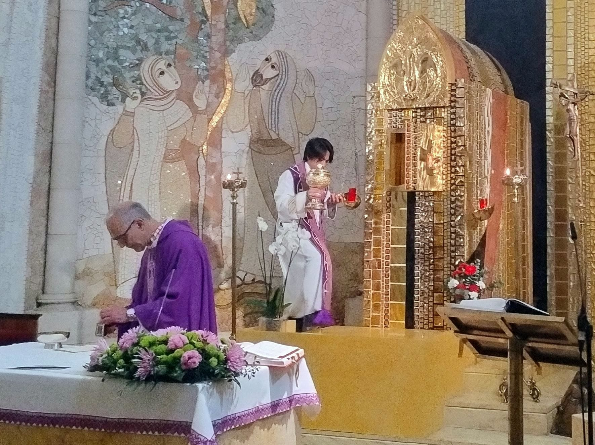

__

##  Peregrinación a la Catedral de la Almudena por el jubileo 

Ayer celebramos la peregrinación a la Catedral de la Almudena para obtener el jubileo desde nuestra parroquia y la de Santa Maria del Buen Consejo. Los P. Javier y Cedric celebraron la eucaristia en la Capilla del Sagrario, que no es muy grande, pero que estaba a rebosar de parroquianos de ambas parroquias. Fué un calebrarión entrañable 

  * [ __](https://www.facebook.com/sharer.php?u=https://la-vid.org/noticias/actual/226-peregrinacion-a-la-catedral-de-la-almudena-por-el-jubileo)

  * 

  * [ __](https://www.linkedin.com/shareArticle?mini=true&url=https://la-vid.org/noticias/actual/226-peregrinacion-a-la-catedral-de-la-almudena-por-el-jubileo "Share On Linkedin")

