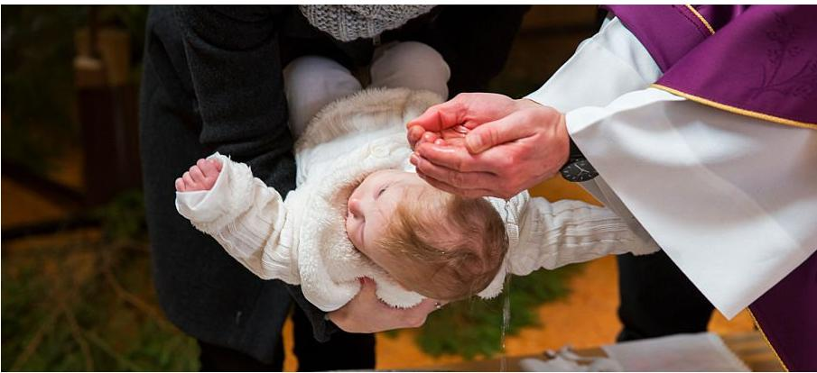

__

El bautismo es el primer sacramento de iniciación cristiana en la Iglesia Católica y es considerado fundamental porque marca el comienzo de la vida espiritual y la pertenencia a la comunidad cristiana. A través del bautismo, la persona es liberada del pecado original, recibe la gracia santificante y se convierte en miembro de la Iglesia.

[ Lee más: EL BAUTISMO ](/sacramentos/bautismo/41-el-bautismo)
