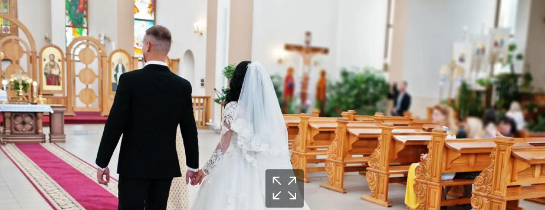

__

El matrimonio católico es uno de los siete sacramentos de la Iglesia Católica, mediante el cual un hombre y una mujer se unen en una alianza sagrada ante Dios y la comunidad. Este sacramento refleja el amor de Cristo por la Iglesia, y es un compromiso de amor mutuo, fidelidad y entrega total que dura toda la vida.

[ Lee más: MATRIMONIO ](/sacramentos/matrimonio/86-matrimonio-1)
