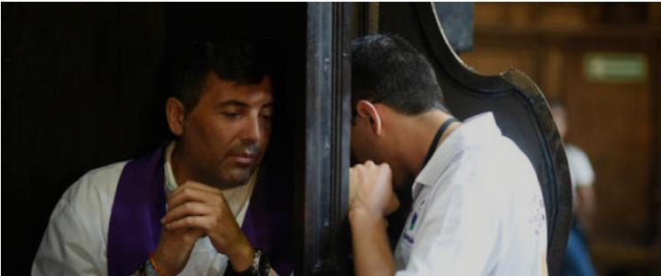

La Reconciliación, también llamada Confesión o Penitencia, es uno de los sacramentos de curación de la Iglesia Católica. A través de este sacramento, los creyentes reciben el perdón de los pecados cometidos después del bautismo y se reconcilian con Dios y la Iglesia. Es un sacramento esencial para restaurar la relación con Dios cuando se ha roto a causa del pecado.

### **Significado de la Reconciliación:**

**1\. Perdón de los pecados:** La Reconciliación permite que los pecados del penitente sean perdonados por Dios. Esto incluye tanto los pecados veniales (menores) como los pecados mortales, que son graves y destruyen la vida de gracia en el alma.

**2\. Reconciliación con Dios:** El pecado rompe nuestra relación con Dios. A través del sacramento de la Reconciliación, esa relación es restaurada, devolviendo la gracia divina a nuestra alma.

**3\. Reconciliación con la Iglesia:** El pecado también afecta a la comunidad de creyentes. La confesión no solo reconcilia al individuo con Dios, sino también con la Iglesia, ya que el pecado debilita la unidad y el amor en la comunidad cristiana.

### **Elementos esenciales de la Reconciliación:**

**1\. Examen de conciencia:** Antes de confesarse, el penitente debe hacer un examen de conciencia para reflexionar sobre sus acciones y reconocer los pecados cometidos. Este paso es fundamental para estar verdaderamente arrepentido.

**2\. Contrición:** Es el arrepentimiento sincero* de los pecados cometidos. Puede ser perfecta (motivada por el amor a Dios) o imperfecta (motivada por el temor a las consecuencias del pecado, como la pérdida de la salvación), pero es esencial para que el sacramento sea válido.

**3\. Confesión de los pecados:** El penitente debe confesar todos los pecados mortales de los que es consciente en número y especie. También es recomendable confesar los pecados veniales, aunque no sea obligatorio.

**4\. Propósito de enmienda:** El penitente debe tener el firme propósito de no volver a pecar y hacer todo lo posible por evitar las ocasiones de pecado.

**5\. Absolución:** Después de la confesión, el sacerdote pronuncia las palabras de absolución, en las que, actuando en el nombre de Cristo y de la Iglesia, perdona los pecados del penitente: _"Yo te absuelvo de tus pecados en el nombre del Padre, y del Hijo, y del Espíritu Santo." En este momento, los pecados quedan perdonados y el penitente es reconciliado con Dios.

**6\. Penitencia: Después de la absolución,** el sacerdote da una penitencia al penitente, que puede ser una oración, un acto de caridad o una obra de reparación. Esto es una forma de expiar los pecados y cooperar con la gracia de Dios.

### **Beneficios de la Reconciliación:**

**1\. Perdón y paz interior:** La Reconciliación otorga al penitente una profunda sensación de paz y alivio al saber que ha sido perdonado por Dios.

**2.Restauración de la gracia:** El sacramento restablece la gracia santificante, es decir, la vida de Dios en el alma, que se pierde con el pecado mortal.

**3\. Fortaleza espiritual:** El sacramento ayuda a evitar futuras caídas en el pecado, fortaleciendo la voluntad y dándole al penitente mayor resistencia a la tentación.

### **¿Quién puede administrar la Reconciliación?**

\- Solo los sacerdotes o obispos pueden administrar el sacramento de la Reconciliación, ya que actúan en la persona de Cristo. Ellos tienen el poder de perdonar los pecados a través del ministerio que les ha sido conferido por la Iglesia.

### **Tipos de pecados:**

**1\. Pecado mortal:** Es un pecado grave que rompe la relación con Dios. Para que un pecado sea mortal, deben cumplirse tres condiciones: materia grave, pleno conocimiento y consentimiento deliberado. El pecado mortal debe confesarse obligatoriamente para recibir el perdón.

**2\. Pecado venial:** Es un pecado leve que daña, pero no destruye, la vida de gracia en el alma. No es necesario confesar los pecados veniales, pero es recomendable, ya que ayuda al crecimiento espiritual y fortalece la voluntad.

### **Frecuencia de la confesión:**

\- Aunque no hay un número fijo de veces para confesarse, la Iglesia recomienda a los católicos que se confiesen con regularidad (al menos una vez al año es obligatorio, especialmente durante el tiempo de Cuaresma o Pascua). Sin embargo, aquellos que han cometido un pecado mortal deben confesarse antes de recibir la Eucaristía.

### **Importancia de la Reconciliación en la vida cristiana:**

La Reconciliación es un sacramento esencial para el crecimiento espiritual de los católicos, ya que permite al creyente examinar su vida, reconocer sus faltas y experimentar el perdón y la misericordia de Dios. A través de este sacramento, los cristianos son restaurados en su camino de santidad y se les ofrece una nueva oportunidad de vivir una vida de gracia y fidelidad a Cristo.

En resumen, la Reconciliación es el sacramento mediante el cual los católicos confiesan sus pecados a Dios, reciben el perdón y son restaurados a la gracia divina. Es un acto de humildad y confianza en la misericordia de Dios, que permite la sanación espiritual y el crecimiento en la vida cristiana.

  * [ __](https://www.facebook.com/sharer.php?u=https://la-vid.org/sacramentos/reconciliacion/23-el-perdon-de-los-pecados)

  * 

  * [ __](https://www.linkedin.com/shareArticle?mini=true&url=https://la-vid.org/sacramentos/reconciliacion/23-el-perdon-de-los-pecados "Share On Linkedin")

