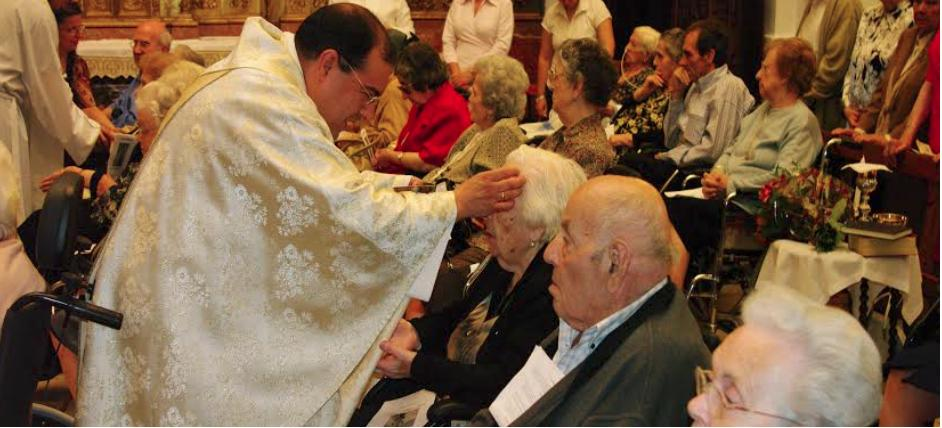

__

##  [ LA DESPEDIDA](/sacramentos/uncion-de-los-enfermos/31-la-despedida)

La Unción de los Enfermos es uno de los sacramentos de curación en la Iglesia Católica. Su propósito es otorgar gracia, consuelo, fortaleza espiritual y, si es la voluntad de Dios, sanación física a quienes sufren una enfermedad grave o se encuentran en peligro de muerte. Este sacramento es un signo del cuidado amoroso de Dios por aquellos que padecen enfermedades o enfrentan situaciones críticas de salud. **Es un sacramento de vivos, no de muertos.**

[ Lee más: LA DESPEDIDA ](/sacramentos/uncion-de-los-enfermos/31-la-despedida)
