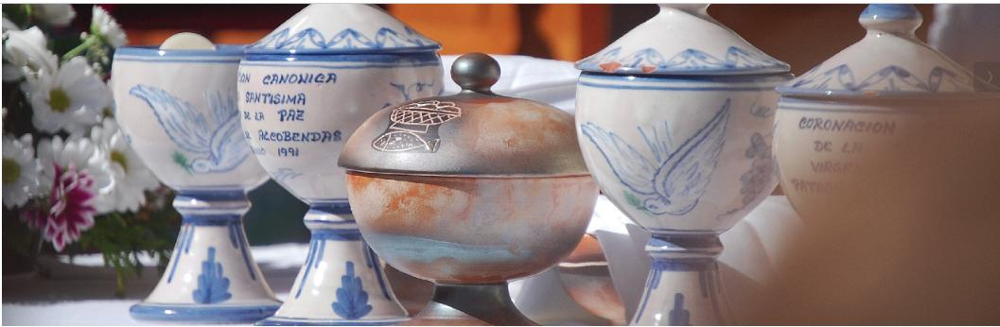

La Comunión Católica, también llamada Eucaristía, es uno de los sacramentos más importantes de la Iglesia Católica, donde los fieles participamos del cuerpo y la sangre de Cristo bajo las especies de pan y vino consagrados. Este sacramento fue instituido por Jesucristo en la Última Cena, cuando dijo:**"Esto es mi cuerpo... esta es mi sangre"** , y pidió a sus discípulos que lo hicieran en su memoria (Lucas 22:19-20).

### **Significado de la Comunión Católica:**

**1\. Presencia real de Cristo:** Los católicos creemos que, durante la Misa, el pan y el vino se transforman en el Cuerpo y la Sangre reales de Cristo a través de un proceso llamado transubstanciación. Aunque conservan la apariencia de pan y vino, su sustancia cambia. Los católicos creemos que Jesús está realmente presente en la Eucaristía.

**2\. Memorial de la Pasión, Muerte y Resurrección de Cristo:** La Eucaristía recuerda el sacrificio que Cristo hizo en la cruz, pero más que un simple recuerdo, es una actualización mística de ese sacrificio. Al participar en la Comunión, los fieles nos unimos unen a ese sacrificio redentor.

**3\. Alimento espiritual:** Al recibir la Comunión, los católicos reciben alimento espiritual que fortalece su fe, les ayuda a vivir una vida cristiana y los une más íntimamente con Cristo. La Comunión también tiene el propósito de perdonar los pecados veniales y proteger a la persona contra el pecado futuro.

**4\. Unidad con la Iglesia:** Participar en la Comunión también es una señal de unidad con la Iglesia Católica. Al recibir la Eucaristía, los católicos renovamos nuestro compromiso con la comunidad de creyentes y con la misión de la Iglesia en el mundo.

### **Elementos esenciales de la Comunión:**

**1\. Pan y vino:** Los elementos utilizados en la Comunión son pan sin levadura (hostias) y vino. Durante la consagración, estos elementos se transforman en el Cuerpo y la Sangre de Cristo, aunque mantienen su apariencia externa de pan y vino.

**2\. La Misa:** La Eucaristía se celebra como parte de la Misa, que es la celebración litúrgica central de la Iglesia Católica. Durante la Misa, el sacerdote consagra el pan y el vino para que se conviertan en el Cuerpo y la Sangre de Cristo.

**3\. Primera Comunión:** Los niños suelen recibir la Primera Comunión alrededor de los 7 años, después de haber recibido una preparación catequética. Este es un momento importante en la vida del creyente, ya que por primera vez participan plenamente en la Eucaristía.

**Requisitos para recibir la Comunión:**

**1\. Estar en estado de gracia:** Para recibir la Comunión, se requiere que la persona esté en estado de gracia, es decir, sin pecado mortal. Si alguien ha cometido un pecado grave, debe primero confesarse en el sacramento de la Reconciliación antes de recibir la Eucaristía.  
  
**2\. Ayuno eucarístico:** Los católicos deben observar un ayuno de al menos una hora antes de recibir la Comunión (excepto agua y medicamentos).

**3\. Fe en la Eucaristía:** Es necesario que quien recibe la Comunión crea en la presencia real de Cristo en la Eucaristía.

### **Efectos de la Comunión:**

**\- Unión íntima con Cristo:** Recibir la Eucaristía fortalece la relación personal del creyente con Cristo.  
**\- Unidad con la Iglesia:** La Eucaristía une a los fieles con la comunidad eclesial.  
**\- Perdón de los pecados veniales:** La Comunión perdona los pecados leves o veniales y ayuda a evitar futuros pecados.  
**\- Fortaleza espiritual:** La Eucaristía da al creyente la gracia necesaria para vivir una vida cristiana más fuerte y fiel.

En resumen, la Comunión es el sacramento por el cual los católicos recibimos a Cristo mismo en el pan y el vino consagrados, fortaleciéndonos espiritualmente y uniéndonos más profundamente con Él y con la Iglesia.
